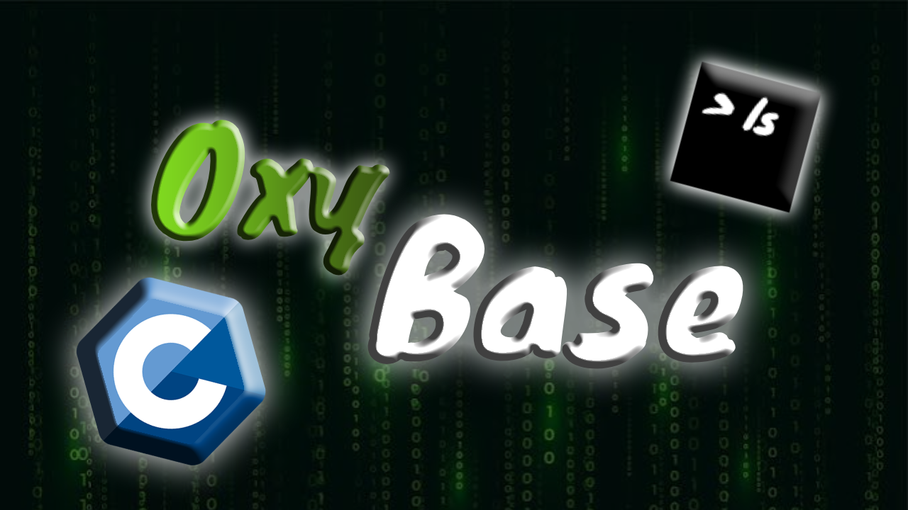
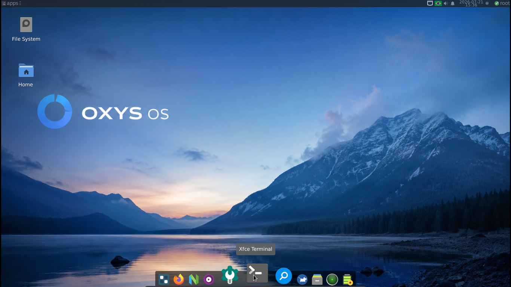
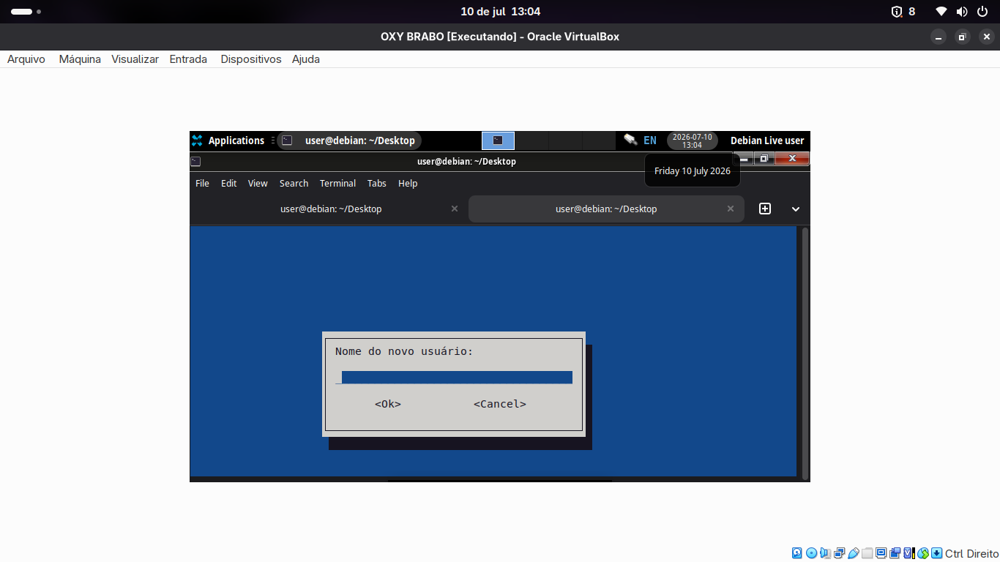

#  Universo Oxy

Bem-vindo à documentação oficial do **Universo Oxy**, um ecossistema de distribuições Linux projetado para diferentes perfis de usuários, unindo o melhor da estabilidade, customização e desenvolvimento. 

Este projeto é mantido em colaboração oficial entre os canais:
*   🎬 **Gabriel (fprowindows):** [Acesse o Canal no YouTube](https://youtube.com/@fprowindows?si=Ut4MthfTAL6Yf5ih)
*   🎬 **JohnzinOmochain:** [Acesse o Canal no YouTube](https://youtube.com/@johnzinomochain?si=dPvf7zzrf67kuxji)

---

## 🚀 Nossas Distribuições

O ecossistema se divide em duas ramificações principais, ambas utilizando atualmente a interface **XFCE**, garantindo leveza máxima e alto desempenho.

### 🐧 Oxy Base (Debian Edition)
*   **Desenvolvedor:** Gabriel (`@fprowindows`)
*   **Foco principal:** Desenvolvimento de software e performance. Ele vem totalmente preparado para quem programa em **linguagem C** e outras linguagens de baixo ou alto nível.
*   **Base do Sistema:** Construído sobre a rocha sólida do **Debian Estável**. Para garantir a máxima estabilidade e compatibilidade em ambientes de produção e hardware variados, o sistema utiliza bases consolidadas como o **Debian 12.1** e outras versões anteriores altamente testadas.
*   **Público-alvo:** Desenvolvedores, programadores e usuários avançados que precisam de um ambiente que nunca quebra.

---

### 🎨 OxyohanOS
*   **Desenvolvedor:** Johnzin (`@JohnzinOmochain`)
*   **Foco principal:** Uso normal/cotidiano e experiência de usuário de ponta.
*   **Base do Sistema:** Utiliza a base estável modificada do projeto principal, adaptada para entregar um sistema extremamente bonito, fluido e pronto para as tarefas do dia a dia.
*   **Público-alvo:** Usuários comuns e desenvolvedores que buscam um sistema moderno, customizado visualmente e prático para navegar, estudar e trabalhar.

Instalador em fase Beta

---

## 🛠️ Filosofia do Ecossistema

O Universo Oxy nasceu da ideia de que um sistema operacional não precisa ser genérico. Enquanto a **Oxy Base** entrega o motor bruto, estável e otimizado para codificação pesada, o **OxyohanOS** lapida essa estrutura para entregar uma interface bonita e acessível para o uso diário. 

Navegue pelo menu lateral para acessar o guia de instalação, documentação do kernel e repositórios de pacotes de cada versão!

## Contato:
JohnzinOmochain: johnzincontato@gmail.com
 
Gabriel do Linux (@fprowindows): apeludoff120@gmail.com ou maguraa53@gmail.com
---
## Licença e Compatibilidade de Hardware

Este sistema e seu código-fonte original (scripts de otimização, ajustes de kernel e configurações) são distribuídos sob a licença **GNU General Public License v3.0 (GPLv3)**.

Para garantir compatibilidade imediata de hardware (como placas Wi-Fi, Bluetooth e touchpads) em notebooks e MacBooks, o sistema inclui drivers e firmwares pré-compilados redistribuídos a partir dos repositórios oficiais `non-free` e `non-free-firmware` da distribuição Debian.
---
## Trabalhando
**Oxys OS**: Trabalhando em um **meta pacote** com um **pos instalaçao** seguido de personalizaçoes de **papel de parede, calamares,fastfetch** e instalaçao de varios app e traz o executavel do fastfeth pois ainda nao consegui embutilo no **posinst** e nem no **Control**. e vale lembrar que este meta pacote nao traz drives...

**OxyohanOS**: Trabalhando no **calamares** e **erros**

end...
